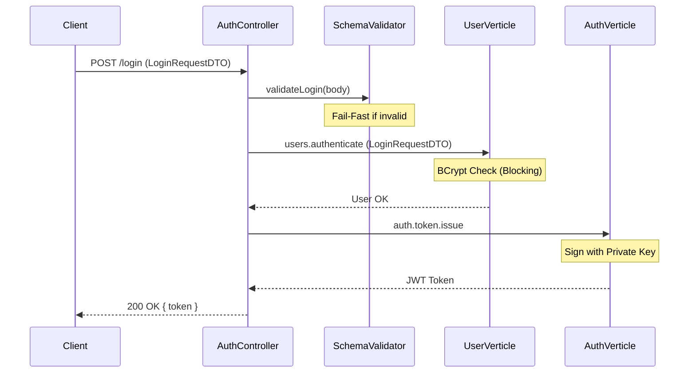
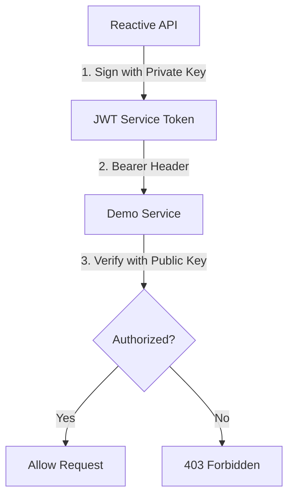

# Authentication System

The Authentication system provides secure service-to-service communication using RS256 JWT tokens.

## Security Architecture

The system employs a **Dual-Token Strategy**:
1.  **User Tokens**: Issued to clients after login. Used to authorize mutations (`POST`, `PUT`, `DELETE`).
2.  **Service Tokens**: Signed by the API to authenticate itself against external services (e.g., `DemoAPI`).

## Components 

### [AuthVerticle](file:///c:/Users/zatari/Desktop/Projects/Reactive_RestAPI/src/main/java/ziadatari/ReactiveAPI/auth/AuthVerticle.java)
- **Purpose**: Specialized verticle for JWT management and token issuance.
- **Responsibilities**:
    - **Key Normalization**: Reconstructs RSA PEM keys from environment variables.
    - **Event Bus Listener**: 
        - `auth.token.get`: Returns cached Service Token.
        - `auth.token.issue`: Generates new User Token (requires username).
    - **Encapsulation**: Owns the `Rs256TokenService`.

### [Rs256TokenService](file:///c:/Users/zatari/Desktop/Projects/Reactive_RestAPI/src/main/java/ziadatari/ReactiveAPI/auth/Rs256TokenService.java)
- **Purpose**: Manages the life-cycle of JWT tokens.
- **Key Features**:
    - **Service Token Generation**: Signs tokens for service-to-service calls (cached, auto-refresh).
    - **User Token Generation**: Generates short-lived (15m) tokens for users with `sub` and `role` claims (role is currently fixed as "user").
    - **Signing**: Uses the loaded RSA Private Key.

### [MainVerticle](file:///c:/Users/zatari/Desktop/Projects/Reactive_RestAPI/src/main/java/ziadatari/ReactiveAPI/main/MainVerticle.java)
- **Purpose**: Orchestrator and Key Provider.
- **Boot Flow**:
    1. Retrieves `RSA_PRIVATE_KEY` and `RSA_PUBLIC_KEY` from environment.
    2. Deploys `AuthVerticle` (Private Key) for signing.
    3. Deploys `HttpVerticle` (Public Key) for local verification.

## Authentication Flows

### 1. User Login Flow (`POST /login`)
The user authenticates to receive a token. The request is first **validated against a JSON Schema** to ensure required fields are present.

### 2. Service-to-Service Flow
The Reactive API authenticates itself to the Demo service for IP verification.

## Security Credentials
- **Algorithm**: RS256 (RSA Signature with SHA-256).
- **Public Key**: Located in the Demo service (`JwtAuthenticationFilter.java`).
- **Private Key**: Located in the Reactive API (`MainVerticle.java`).

## Integration in Web Layer
The `VerificationHandler` in the `auth` package uses the **Event Bus** to fetch tokens.
- **Request**: Sends a message to `auth.token.get`.
- **Response**: Receives a String token or a failure if the `AuthVerticle` is not configured.
- **V1 Routes**: Skip authentication.
- **V3 Routes**: Require token injection via the `Authorization: Bearer <token>` header.
