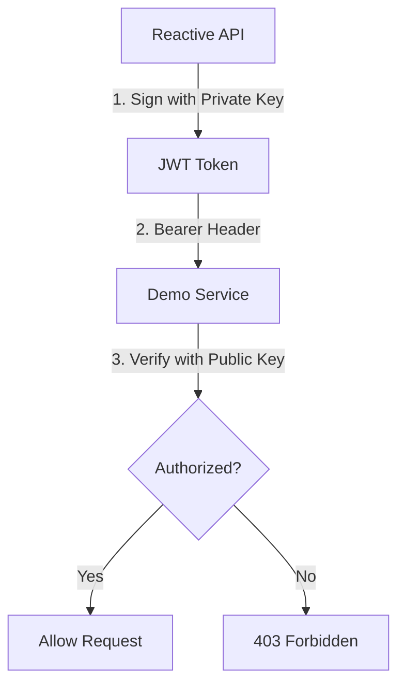

# Authentication System

The Authentication system provides secure service-to-service communication using RS256 JWT tokens.

## Components

### [Rs256TokenService](file:///c:/Users/zatari/Desktop/Projects/Reactive_RestAPI/src/main/java/ziadatari/ReactiveAPI/service/Rs256TokenService.java)
- **Purpose**: Manages the life-cycle of JWT tokens for external API calls.
- **Key Features**:
    - **Token Generation**: Signs tokens using an RSA Private Key.
    - **Caching**: Stores the generated token in an `AtomicReference` to minimize CPU-intensive signing operations.
    - **Thread Safety**: Uses lock-free primitives (`AtomicReference`, `AtomicLong`) to ensure safe access across multiple event loops.
    - **Refresh Logic**: Automatically re-generates the token when it is within 5 minutes (`REFRESH_BUFFER_SECONDS = 300`) of expiration.
    - **Error Handling**: Gracefully handles initialization failures (e.g., malformed RSA keys), allowing the system to start with restricted functionality by returning a `ServiceException` with `AUTH_SETUP_ERROR`.

### [MainVerticle](file:///c:/Users/zatari/Desktop/Projects/Reactive_RestAPI/src/main/java/ziadatari/ReactiveAPI/main/MainVerticle.java)
- **Purpose**: Initializes the `JWTAuth` provider and injects the `TokenService` into the web layer.
- **Boot Flow**:
    1. Loads the RSA Private Key from an environment variable or hardcoded default.
    2. Configures `JWTAuthOptions` with the provider.
    3. Handles setup exceptions by providing a "dummy" or "failed" token service that logs warnings instead of crashing.

## Secure Communication Flow

The Reactive API acts as a client to the Demo service.

## Security Credentials
- **Algorithm**: RS256 (RSA Signature with SHA-256).
- **Public Key**: Located in the Demo service (`JwtAuthenticationFilter.java`).
- **Private Key**: Located in the Reactive API (`MainVerticle.java`).

## Integration in Web Layer
The `VerificationHandler` in the `HttpVerticle` uses the `TokenService` to fetch a valid token before making calls to the `/v3/ip` endpoint of the Demo service.
- **V1 Routes**: Skip authentication.
- **V3 Routes**: Require token injection via the `Authorization: Bearer <token>` header.
