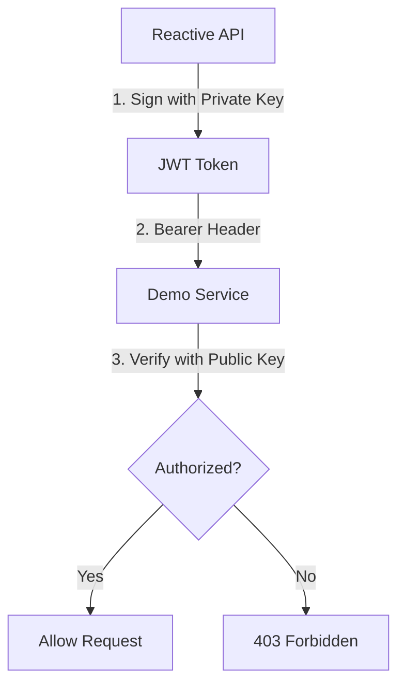

# Authentication System

The Authentication system provides secure service-to-service communication using RS256 JWT tokens.

## Components

### [AuthVerticle](file:///c:/Users/zatari/Desktop/Projects/Reactive_RestAPI/src/main/java/ziadatari/ReactiveAPI/auth/AuthVerticle.java)
- **Purpose**: Specialized verticle for JWT management and token issuance.
- **Responsibilities**:
    - **Key Normalization**: Reconstructs RSA PEM keys from environment variables (handles single-line formats).
    - **Event Bus Listener**: Consumes `auth.token.get` requests.
    - **Encapsulation**: Owns the `Rs256TokenService`.

### [Rs256TokenService](file:///c:/Users/zatari/Desktop/Projects/Reactive_RestAPI/src/main/java/ziadatari/ReactiveAPI/auth/Rs256TokenService.java)
- **Purpose**: Manages the life-cycle of JWT tokens for external API calls.
- **Key Features**:
    - **Token Generation**: Signs tokens using an RSA Private Key.
    - **Caching**: Stores the generated token in an `AtomicReference`.
    - **Logging**: Uses SLF4J for structured operational logging.
    - **Refresh Logic**: Automatically re-generates tokens with a 5-minute buffer.

### [MainVerticle](file:///c:/Users/zatari/Desktop/Projects/Reactive_RestAPI/src/main/java/ziadatari/ReactiveAPI/main/MainVerticle.java)
- **Purpose**: Orchestrates the deployment of the `AuthVerticle`.
- **Boot Flow**:
    1. Retrieves the `RSA_PRIVATE_KEY` from environment variables.
    2. Deploys `AuthVerticle` with the key provided in the configuration object.
    3. Handles deployment failures globally.

## Secure Communication Flow

The Reactive API acts as a client to the Demo service.

## Security Credentials
- **Algorithm**: RS256 (RSA Signature with SHA-256).
- **Public Key**: Located in the Demo service (`JwtAuthenticationFilter.java`).
- **Private Key**: Located in the Reactive API (`MainVerticle.java`).

## Integration in Web Layer
The `VerificationHandler` in the `auth` package uses the **Event Bus** to fetch tokens.
- **Request**: Sends a message to `auth.token.get`.
- **Response**: Receives a String token or a failure if the `AuthVerticle` is not configured.
- **V1 Routes**: Skip authentication.
- **V3 Routes**: Require token injection via the `Authorization: Bearer <token>` header.
