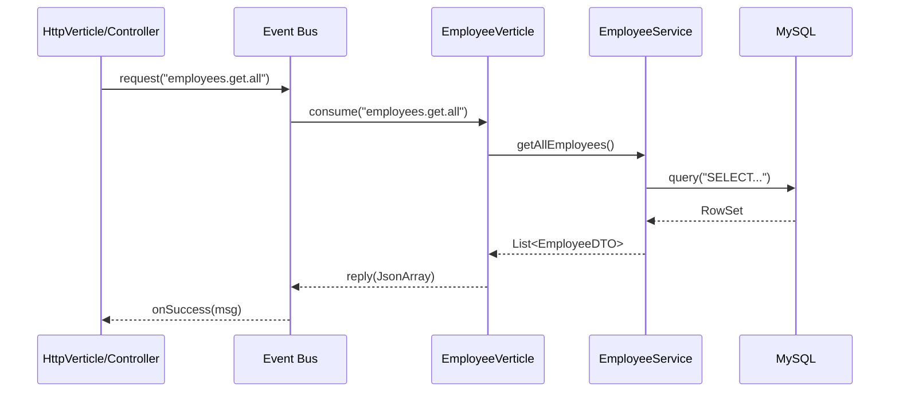

# Repository System

The Repository system manages data persistence and business logic orchestration using a reactive, non-blocking architecture.

## Components

### [EmployeeRepository](file:///c:/Users/zatari/Desktop/Projects/Reactive_RestAPI/src/main/java/ziadatari/ReactiveAPI/repository/EmployeeRepository.java)
- **Purpose**: Direct interaction with the MySQL database.
- **Technology**: Vert.x MySQL Client (Reactive).
- **Key Features**:
    - Uses a `Pool` for asynchronous connection management.
    - Prepared queries for SQL injection prevention.
    - Soft-delete implementation (marking records as inactive).
    - Mapping of SQL `RowSet` to `EmployeeDTO`.

### [EmployeeVerticle](file:///c:/Users/zatari/Desktop/Projects/Reactive_RestAPI/src/main/java/ziadatari/ReactiveAPI/repository/EmployeeVerticle.java)
- **Purpose**: Acts as a worker verticle that isolates data access from the web layer.
- **Deployment**: Deployed sequentially *before* the `HttpVerticle` to ensure the Event Bus consumers are ready.
- **Flow**:
    - Listens for messages on the Vert.x Event Bus (e.g., `employees.get.all`, `employees.create`).
    - Orchestrates calls to the `EmployeeService`.
    - Returns responses or fails messages back to the requester.
- **Resilience**: Configures a `CircuitBreaker` to protect database operations from cascading failures.
- **Connection Pool**: Initializes a `Pool` with `setMaxSize(10)` to limit concurrent DB connections.

### [EmployeeService](file:///c:/Users/zatari/Desktop/Projects/Reactive_RestAPI/src/main/java/ziadatari/ReactiveAPI/service/EmployeeService.java)
- **Purpose**: Contains business logic and validation rules.
- **Logic**:
    - Validates DTO fields before persistence.
    - Handles conflict detection (e.g., preventing duplicates or reactivating soft-deleted records).
    - Wraps repository calls in circuit breaker execution blocks.

## Communication Pattern: Event Bus

The Repository system is completely decoupled from the Web layer via the Vert.x Event Bus.

## Resilience & Fault Tolerance
Database interactions are guarded by a `CircuitBreaker` configured in `EmployeeVerticle`.
- **Threshold**: 5 consecutive failures.
- **Timeout**: 200ms per operation.
- **Reset**: Attempts recovery after a short reset period.
