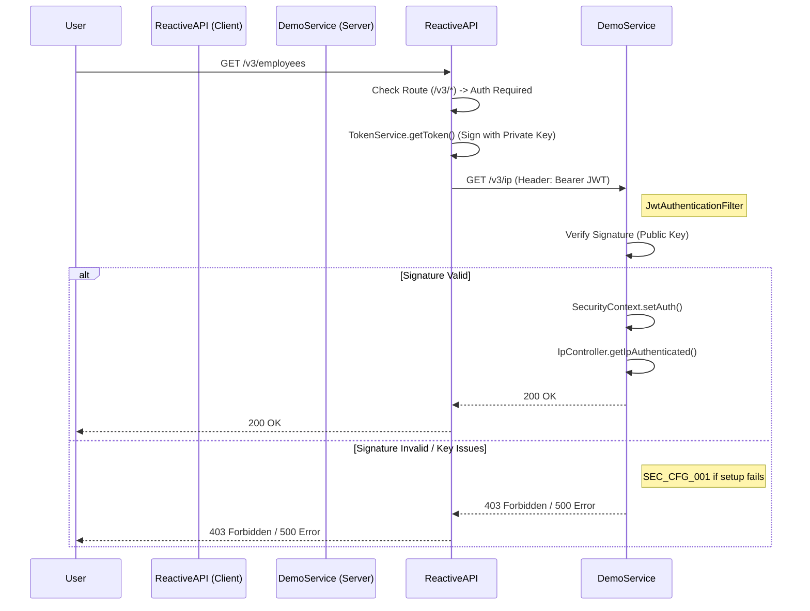

# Authentication Flow Analysis

This document details the authentication mechanism implementation trace, covering both the client (`ReactiveAPI`) and the server (`demo`).

## 1. Client-Side: ReactiveAPI (The Caller)

### 1.1 Initialization (MainVerticle.java)
The authentication logic relies on a **Singleton Pattern** for token management to ensure scalability across multiple event loops.
*   **Identity**: A hardcoded RSA Private Key (`RS256`) is used to sign tokens.
*   **Service**: A single instance of [Rs256TokenService](file:///c:/Users/zatari/Desktop/Projects/Reactive_RestAPI/src/main/java/ziadatari/ReactiveAPI/service/Rs256TokenService.java#12-62) is created and injected into every [HttpVerticle](file:///c:/Users/zatari/Desktop/Projects/Reactive_RestAPI/src/main/java/ziadatari/ReactiveAPI/web/HttpVerticle.java#15-86).

### 1.2 Token Management (Rs256TokenService.java)
*   **Lifecycle**: Tokens are cached in memory and valid for 1 hour.
*   **Refresh Strategy**: Tokens are auto-refreshed 5 minutes before expiration.
*   **Efficiency**: Thread-safe `AtomicReference` ensures high performance without locking.

### 1.3 Route Configuration (HttpVerticle.java)
Routes are split by version:
*   **Public (`/v1/*`)**: Proxies to `/v1/ip`. Auth is **disabled**.
*   **Secure (`/v3/*`)**: Proxies to `/v3/ip`. Auth is **required** (injects [Rs256TokenService](file:///c:/Users/zatari/Desktop/Projects/Reactive_RestAPI/src/main/java/ziadatari/ReactiveAPI/service/Rs256TokenService.java#12-62)).

### 1.4 Execution (VerificationHandler.java)
Middleware intercepts requests:
1.  **Check**: If `requireAuth` is true, fetches a valid JWT from the singleton service.
2.  **Inject**: Adds `Authorization: Bearer <token>` header to the downstream request.
3.  **Call**: Forwards the request to the `demo` service.

---

## 2. Server-Side: Demo Service (The Verifier)

The `demo` service acts as the resource server, validating the identity asserted by `ReactiveAPI`.

### 2.1 Security Configuration (SecurityConfig.java)
Spring Security is configured to enforce access control based on URL patterns:
*   **Public Access**: `/ip` and `/v1/ip` are `permitAll()`. No checks are performed.
*   **Secure Access**: `/v3/**` is `authenticated()`. Any request without a valid signature is rejected (403 Forbidden).
*   **Filter Chain**: A custom [JwtAuthenticationFilter](file:///c:/Users/zatari/Desktop/Projects/Reactive_RestAPI/demo/src/main/java/com/example/demo/JwtAuthenticationFilter.java#23-94) is inserted before the standard auth filter.

### 2.2 Token Verification (JwtAuthenticationFilter.java)
This filter validates the JWT on every request to a secure endpoint.
*   **Public Key**: Contains the hardcoded **RSA Public Key** corresponding to `ReactiveAPI`'s private key.
*   **Sanitization**: The code manually strips `-----BEGIN PUBLIC KEY-----`, newlines, and whitespace to prevent PEM parsing errors.
*   **Validation**:
    *   Extracts the token from the `Authorization: Bearer` header.
    *   Uses `Jwts.parserBuilder()` with `RS256` to verify the digital signature.
    *   **Clock Skew**: Allows for a 60-second time difference between servers.
*   **Outcome**:
    *   **Valid**: Sets the `SecurityContext` authentication, allowing the request to proceed.
    *   **Invalid**: Logs an error; `SecurityContext` remains empty, causing [SecurityConfig](file:///c:/Users/zatari/Desktop/Projects/Reactive_RestAPI/demo/src/main/java/com/example/demo/SecurityConfig.java#10-35) to deny access.

### 2.3 Endpoint Logic (IpController.java)
The controller provides the verification result.
*   **Dual Entry Points**:
    *   [getIpLegacy](file:///c:/Users/zatari/Desktop/Projects/Reactive_RestAPI/demo/src/main/java/com/example/demo/IpController.java#18-22) (mapped to `/ip`, `/v1/ip`) -> Unsecured.
    *   [getIpAuthenticated](file:///c:/Users/zatari/Desktop/Projects/Reactive_RestAPI/demo/src/main/java/com/example/demo/IpController.java#23-27) (mapped to `/v3/ip`) -> Secured.
*   **Simulation**:
    *   Both endpoints delegate to [processIpRequest](file:///c:/Users/zatari/Desktop/Projects/Reactive_RestAPI/demo/src/main/java/com/example/demo/IpController.java#28-65).
    *   **Latency**: 1% chance of 500ms-5000ms delay.
    *   **Chaos**: 1% chance of returning random errors (408, 429, 503, 500).

## 4. Robust Error Handling (RSA Key Issues)

Specific handling is implemented to address malformed or mismatched RSA keys, preventing generic "500 Internal Server Error" responses.

### 4.1 Client-Side (ReactiveAPI)
*   **Startup Validation**: `MainVerticle` wraps `JWTAuth` initialization in a try-catch. Failure to parse the private key logs a WARNING and initializes the `Rs256TokenService` in an error state **without failing the deployment**.
*   **Generation Safety**: `Rs256TokenService` checks for initialization errors during `getToken()`. If it was initialized with an error (or if signing fails at runtime), it returns a `ServiceException` with `ErrorCode.AUTH_SETUP_ERROR` (SEC_002).

### 4.2 Server-Side (Demo Service)
*   **Proactive Detection**: `JwtAuthenticationFilter` attempts to load the public key on the first request and caches it.
*   **JSON Error Response**: If key loading fails, the filter intercepts `/v3/**` requests and returns a manual JSON payload:
    ```json
    {
      "error": "Security Configuration Error",
      "message": "Public Key is invalid or malformed",
      "code": "SEC_CFG_001"
    }
    ```

## 5. Summary Diagram (End-to-End)

