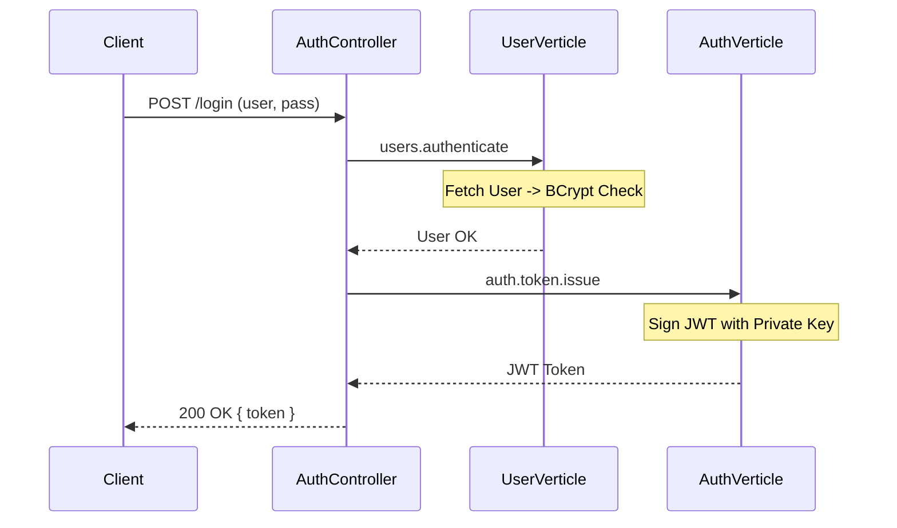
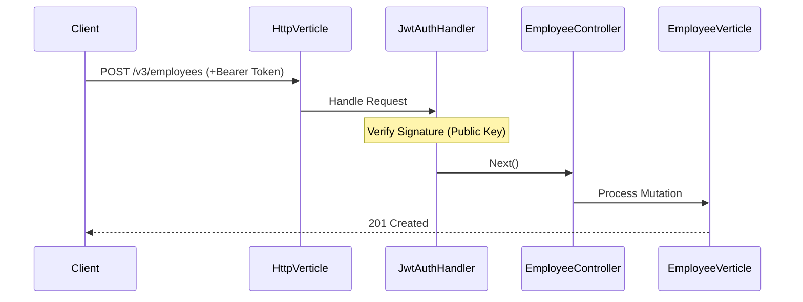

# V3.2 Login System Implementation Review

This document details the successful implementation of the **User-Centric Login System** for the Reactive Rest API. The system secures critical mutation operations (`POST`, `PUT`, `DELETE`) using JWT authentication while maintaining a non-blocking, reactive architecture.

## 1. Architecture Overview

 The solution follows a decoupled, Event Bus-driven design connecting three distinct layers:
1.  **Web Layer**: Handles HTTP requests and JWT verification.
2.  **Auth Layer**: Manages Token generation and signing.
3.  **Data Layer**: Manages User credentials and password hashing.

---

## 2. Component Deep Dive

### A. Data Layer (User Management)
**Location**: `ziadatari.ReactiveAPI.repository`

*   **`User.java`**: Domain entity representing a system user (`username`, `password_hash`).
*   **`UserRepository.java`**: 
    *   Uses **Reactive MySQL Client** for non-blocking database access.
    *   `findByUsername`: Fetches user credentials safely using prepared statements.
*   **`UserVerticle.java`**:
    *   **Role**: The "Authentication Worker".
    *   **Event Bus Consumer**: Listens on `users.authenticate`.
    *   **Performance**: Offloads the CPU-intensive `BCrypt.checkpw()` operation to a blocking executor via `vertx.executeBlocking`. This ensures the Event Loop remains unblocked during password verification.
    *   **Logic**: Returns user details on success or fails with `401 Unauthorized`.

### B. Auth Layer (Token Issuance)
**Location**: `ziadatari.ReactiveAPI.auth`

*   **`Rs256TokenService.java`**:
    *   **Algorithm**: **RS256** (RSA Signature with SHA-256).
    *   **Functionality**: Generates **User Tokens** with a 15-minute expiration.
    *   **Claims**: Includes `sub` (username) and `role` ("user").
*   **`AuthVerticle.java`**:
    *   **Event Bus Consumer**: Listens on `auth.token.issue`.
    *   **Key Management**: Loads the **RSA Private Key** from environment variables to sign tokens.

### C. Web Layer (Interface & Security)
**Location**: `ziadatari.ReactiveAPI.web`

*   **`AuthController.java`**:
    *   **Endpoint**: `POST /login`.
    *   **Flow**:
        1.  Receives JSON payload (`username`, `password`).
        2.  Sends message to `users.authenticate` (UserVerticle).
        3.  On success, sends message to `auth.token.issue` (AuthVerticle).
        4.  Returns the generated JWT in the response body.
*   **`JwtAuthHandler.java`**:
    *   **Role**: Middleware for **Route Protection**.
    *   **Mechanism**:
        *   Extracts `Authorization: Bearer <token>` header.
        *   Verifies the JWT signature using the local **RSA Public Key**.
        *   Unlike issuance, verification happens locally in the HTTP handler for maximum performance (no Event Bus overhead for every request).
    *   **Scope**: Applied to `/v3/*` mutation routes.

---

## 3. Request Flow

### Login Flow (`POST /login`)

### Protected Request Flow (`POST /v3/employees`)

---

## 4. Key Implementation Decisions

1.  **Why Event Bus?**
    *   Decoupling: The Web layer doesn't know about the DB or Auth implementation details.
    *   Scalability: `UserVerticle` and `AuthVerticle` can be scaled independently.

2.  **Why `executeBlocking` for BCrypt?**
    *   BCrypt is intentionally slow/heavy to resist brute-force attacks. Running it on the Event Loop would freeze the server. Using `executeBlocking` moves it to a worker thread pool.

3.  **Why RS256?**
    *   Asymmetric cryptography allows `AuthVerticle` to hold the **Private Key** (signing) while `HttpVerticle` (and potentially other services) only needs the **Public Key** (verification). This improves security distribution.

4.  **Why `ReplyException` Handling?**
    *   We updated `GlobalErrorHandler` to catch Vert.x `ReplyException`. This allows `UserVerticle` to simply "fail" a message with code `401`, and the Web Layer automatically translates that into a proper HTTP 401 response without messy try-catch blocks in the Controller.
